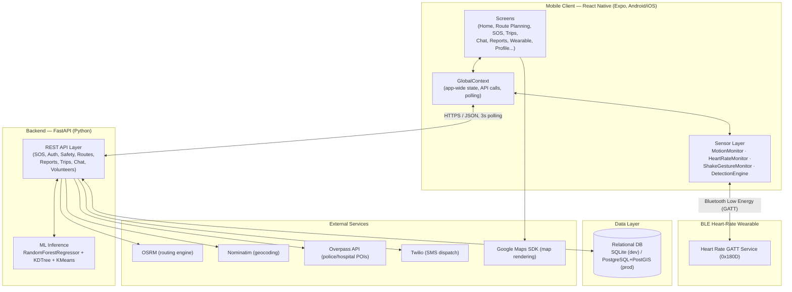
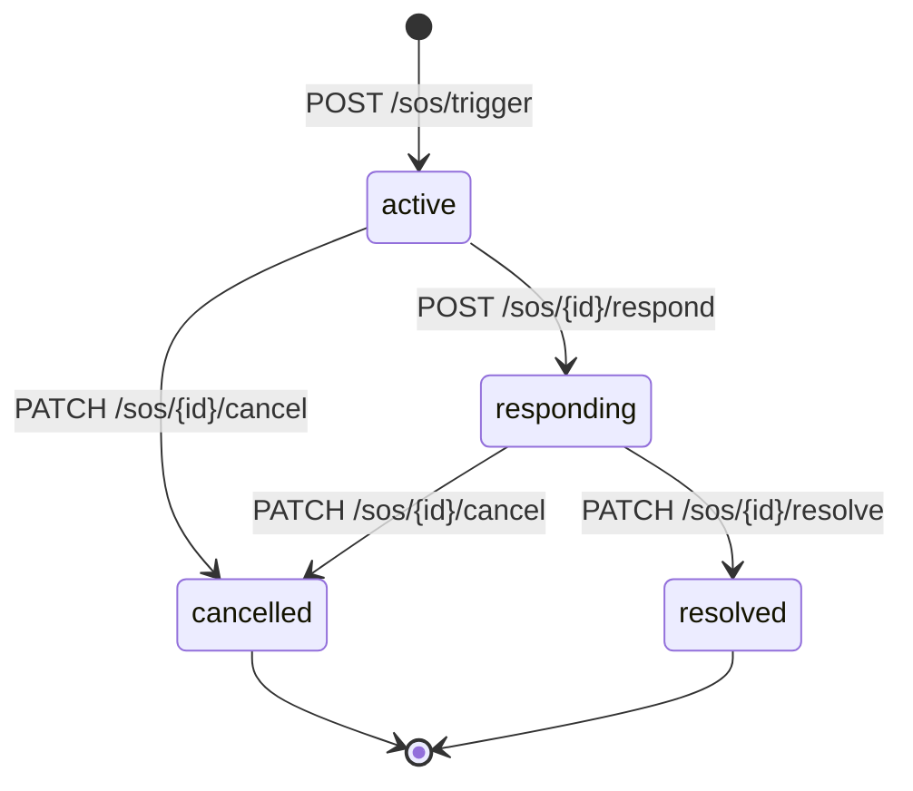

# AEGIS — Project Report

**A cross-platform (Android/iOS) safety companion app that scores routes and locations against real crime data, detects distress automatically from a paired wearable, and coordinates a community of nearby volunteer responders — all backed by a FastAPI + machine-learning backend.**

AEGIS combines three things that are usually separate products into one app and one data model:

1. **Prevention** — ML-scored route planning and a live crime heatmap, so you can choose the *safest* path, not just the fastest one.
2. **Response** — a manual SOS button **and** an automatic, sensor-fused distress detector (heart-rate + motion + shake-gesture) that can fire an alert even when the user can't operate their phone.
3. **Community** — registered volunteer responders and nearby app users see active SOS events and incident reports, can respond, get routed straight to the victim, and chat in-app once assigned.

---

## Table of Contents

- [Feature Overview](#feature-overview)
- [System Architecture](#system-architecture)
- [Core Algorithms](#core-algorithms)
- [End-to-End Workflows](#end-to-end-workflows)
- [API Reference](#api-reference)
- [Data Model](#data-model)
- [Technology Stack](#technology-stack)
- [Project Structure](#project-structure)
- [Getting Started](#getting-started)
- [Configuration](#configuration)
- [Known Limitations](#known-limitations)

---

## Feature Overview

### 🗺️ Safety-Aware Route Planning
Search an origin and destination (Nominatim-powered place search), fetch up to 3 alternative routes from OSRM, and score every point along each route with a trained `RandomForestRegressor`. Routes are labeled **Fastest**, **Safest**, or **Balanced**, colored on the map, and shown with a 0–100 "safety %" badge. Selecting a route hands it to the Home map for live turn-by-turn tracking with a tilted, heading-aware camera.

### 🔥 Live Crime Heatmap & Location Safety Score
The Home map overlays ~3,000 clustered, severity-ranked points from a seeded 32,500-row historical crime dataset for Bengaluru. The same ML model can score any single coordinate (e.g. "how safe is *here*, *right now*") for the Safety screen's current-location score and the "find a safe zone nearby" feature.

### 🆘 Manual SOS
A red SOS button is reachable from a dedicated tab on every screen. Triggering it creates a server-side `SOSEvent`, notifies nearby volunteers, and (when Twilio credentials are configured) sends a real SMS to the user's emergency contact with a live Google Maps location link — with nearby available "guardians" listed in the message. A 15-second countdown gives the user a last chance to cancel with "I'm Safe."

### ⌚ Automatic Wearable-Based Distress Detection
The most safety-critical subsystem. A Bluetooth Low Energy heart-rate wearable (any standard GATT Heart Rate Service device) is fused with the phone's own accelerometer:
- Elevated heart rate **and** phone stillness sustained for 8 seconds, **or** a sudden fall-like acceleration spike, is treated as a possible emergency.
- The user gets a 10-second cancellable countdown (`AutoSOSCountdownModal`) before anything is sent.
- A 60-second cooldown after every cancel or dispatch prevents the same still-true condition from re-firing every ~20 seconds.
- The BLE connection is monitored and automatically retried (up to 5 attempts) if it silently drops.

### 🤳 Shake-Gesture SOS
An independent, opt-in trigger: shaking the phone hard enough fires the same countdown-then-dispatch flow as the wearable detector, for situations where no wearable is paired.

### 🎭 Fake Call Decoy
A long-press on the Profile tab icon (toggleable, ~650ms) launches a realistic fake incoming-call screen — a discreet way to excuse yourself from an uncomfortable situation. Customizable caller name/photo from the Profile screen so it looks like an expected contact.

### 👥 Community Responder Network
- Volunteers register with location, response radius (default 2 km), time-of-day availability window, language, and first-aid training flag.
- When an SOS fires, the backend finds volunteers within radius **and** currently "available" by time of day, notifies them (and the victim's emergency contact) by SMS, and surfaces the event on nearby users' live maps.
- Any nearby app user can tap **Respond** on an active SOS; the backend assigns them as the responder (first responder wins, enforced server-side).
- Once a responder is assigned, the app **automatically fetches and draws a live route from the responder's current location to the victim** — the same OSRM + ML-scoring pipeline used for route planning, so the responder isn't just told a direction, they get a real navigable path.
- The SOS lifecycle (`active → responding → resolved`/`cancelled`) is tracked server-side and polled by all interested clients every 3 seconds.

### 💬 In-App Chat
Once a responder is assigned to an SOS or an incident report, a lightweight polling-based chat thread opens between victim/reporter and responder — no separate messaging infra, keyed by `(thread_type, thread_id)`.

### 🚶 Trip Sharing ("Share My Walk/Ride")
Independent of SOS: start a trip, optionally set a destination and ETA, and text a 6-character trip code to a guardian via the native SMS composer. The recipient opens **Track a Shared Trip**, enters the code, and watches your live location (polled every 3s) update on a map until you end the trip.

### 📝 Community Incident Reporting
Report a non-emergency safety incident (theft, harassment, suspicious activity, etc.) with an optional photo and a tap-to-place map location. Other nearby users can **confirm** a report is real (one confirmation per user per report, enforced by a DB unique constraint) and a responder can claim and resolve it, with the same chat thread available.

### 🚓 Nearby Police & Hospitals
Pulls real points of interest from the OpenStreetMap Overpass API around the user's current location.

### 📚 Safety Learn Center
An offline reference library (CPR basics, first aid, situational-awareness tips) accessible from the Safety tab — no backend calls, pure on-device content.

### 👤 Onboarding, Login & Profile
Phone-based OTP login (a real 4-digit OTP is generated and stored server-side, with expiry — sent via Twilio when configured, otherwise logged/returned for local dev), profile setup (name, home area, emergency contact), and a persisted profile (AsyncStorage) so it survives app restarts. Profile also holds the wearable-monitoring toggle, shake-SOS toggle, and fake-call customization.

---

## System Architecture

AEGIS is a client–server application: a React Native mobile client talks to a stateless FastAPI backend over REST, backed by a relational database and several external services.



### Client Layer
Built with **React Native 0.81** on **Expo SDK 54** (New Architecture / Fabric).

| Component | Responsibility |
|---|---|
| `App.js` | Root composition — mounts `GlobalProvider`, the navigator, a floating `GlobalSOSButton`, and an `AegisMonitoringOverlay` that runs the wearable/shake detection pipelines independently of whatever screen is active |
| `GlobalContext.js` | Single source of truth for session state (user, profile, location), every backend API call, and the two monitoring hooks (`useAegisMonitoring`, `useShakeSOSTrigger`) |
| `AppNavigator.js` | Bottom-tab navigator (Home, Route, SOS, Safety, Profile) nested in a stack navigator (Onboarding, Login, Trips, Chat, Reports, Wearable Setup, Fake Call, ...) |
| `src/sensors/` | `MotionMonitor` (accelerometer), `HeartRateMonitor` (BLE GATT client), `ShakeGestureMonitor`, and `DetectionEngine` (fusion + decision logic) |

The sensor layer is instantiated once at the app root, not per-screen, so the BLE connection and detection state persist across navigation and any screen can observe them via context.

### Server Layer
Built with **FastAPI**, served by **Uvicorn**, using **SQLAlchemy 2.0**. The API is stateless — no server-side session state between requests. Endpoints group into seven domains: Emergency (SOS), Authentication, Safety intelligence, Route planning, Volunteers, Trips, Chat, and Community reporting (see [API Reference](#api-reference)).

### Data Layer
Deployment-agnostic — **SQLite** for local development, **PostgreSQL + PostGIS** in production (`GeoAlchemy2` abstracts the geometry column so model code is unchanged either way). See [Data Model](#data-model).

### External Services
- **OSRM** — alternative route geometries between two points.
- **Nominatim** — free-text place search and reverse geocoding.
- **Overpass API** — nearby police stations / hospitals from OpenStreetMap.
- **Twilio** — SMS dispatch (OTP, SOS alerts, volunteer notifications).
- **Google Maps SDK** — on-device native map rendering.

---

## Core Algorithms

### 1. Wearable-Based Automatic Distress Detection
Evaluated on every new heart-rate or motion sample (`frontend/src/sensors/DetectionEngine.js`):

| Constant | Value | Meaning |
|---|---|---|
| `HR_THRESHOLD` | 130 bpm | Heart rate counted as "elevated" |
| `STILLNESS_VARIANCE` | 0.02 | Accelerometer variance counted as "not moving" |
| `FALL_SPIKE_THRESHOLD` | 2.5 g | Acceleration magnitude counted as a possible fall |
| `CONFIRM_WINDOW` | 8 s | A condition must hold continuously this long before it's "detected" |
| `COUNTDOWN` | 10 s | Cancellable window between detection and dispatch |
| `COOLDOWN` | 60 s | Suppression period after a cancel or dispatch |

```
conditionHolds = fallSpike OR (highHR AND isStill)
```
If `conditionHolds` is continuously true for `CONFIRM_WINDOW`, a `DangerDetected` event fires with a heuristic confidence score (base 0.5, +0.20 elevated HR, +0.15 stillness, +0.25 fall spike, +0.10 if HR is 20+ bpm past threshold, capped at 0.98). The cooldown is armed on **both** the cancel path and the successful-dispatch path — without it, a still-elevated reading would re-fire a fresh 8s window immediately and re-dispatch a new SOS roughly every 18–20 seconds.

### 2. ML-Based Geographic Safety Scoring
A `RandomForestRegressor` (scikit-learn; 100 trees, max depth 16) predicts a continuous danger score from geography and time.

**Training** (`backend/train_model.py`): positive examples are the ~32,500 historical crime coordinates (severity = 1, synthetic time centered at 22:00); negative examples are up to 10,000 synthetically generated coordinates filtered by minimum distance from any known crime point (severity = 0, synthetic time centered at 12:00). Features per point: `[lat, lon, hour, spatial_density, hotspot_distance, cluster_id]`, where spatial density is the inverse mean distance to the 50 nearest crime points (k-d tree) and hotspot distance/cluster id come from a 20-cluster K-Means fit over the crime data.

**Inference**:
```
density   = 1 / mean(distance to 50 nearest crime points)
hotspot   = distance to nearest of 20 K-Means cluster centroids
score     = mean(tree predictions) + 0.4 * max(tree predictions)
```
Blending the mean with a weighted maximum biases the score toward the forest's most pessimistic tree — a deliberately conservative choice for a safety application. For route scoring, every coordinate along a candidate route's geometry is scored this way and aggregated the same way across the whole route.

### 3. Nearby Responder Matching
```
for each volunteer:
    if haversine(sos, volunteer) <= volunteer.radius AND isAvailable(volunteer, currentHour):
        notify(volunteer)

isAvailable: "Always" → true | "Mornings" → 6–12 | "Evenings" → 12–21 | "Nights" → 21–6
```
Time-of-day is evaluated in IST. Matched volunteers are SMS-notified (when Twilio is configured) and surfaced on the live SOS feed so a response can come through either channel.

### 4. SOS Event Lifecycle

`active`/`responding` events are visible to nearby users via `GET /api/sos/active` (distance-filtered, excluding the triggering user's own phone). Clients poll this — and the responder-route/chat/active-SOS-status endpoints — on a fixed 3-second interval rather than relying on push infrastructure.

### 5. Responder-to-Victim Routing
When a client's own phone number matches the `responder_id` on a polled SOS event, `HomeScreen` requests `GET /api/routes` from the responder's live location to the victim's SOS coordinates and draws the returned (ML-scored) route as a live polyline on the map — reusing the exact same routing/scoring pipeline built for route planning, so a responder gets a real navigable path instead of just a pin.

---

## End-to-End Workflows

### Victim / user in danger
1. **Manual:** tap the SOS tab → 15s countdown (or immediate send) → `POST /api/sos/trigger` → nearby volunteers matched and SMS'd → emergency contact SMS'd with a live location link → event visible to nearby users.
2. **Automatic (wearable):** pair a BLE heart-rate device in Wearable Setup → toggle monitoring on → `DetectionEngine` fuses HR + motion in the background → sustained distress or a fall spike → 10s cancellable countdown modal → on timeout, the same `trigger_sos` flow as above fires with `source=auto_wearable` and a detection snapshot (BPM, motion score, confidence).
3. **Automatic (shake):** toggle shake-SOS on → a hard shake fires the same countdown-then-dispatch flow with `source=auto_shake`.
4. At any point, cancel with "I'm Safe" → `PATCH /api/sos/{id}/cancel`.

### Responder / nearby community member
1. The Home map polls `GET /api/sos/active` every 3s and renders active events as pulsing markers.
2. Tap a marker → view details → **Respond** → `POST /api/sos/{id}/respond` assigns this device as responder (server-enforced, first to respond wins).
3. The app fetches `GET /api/routes` from the responder's location to the victim and overlays the live route.
4. A chat thread opens between responder and victim (`/api/messages`, keyed by `thread_type=sos`).
5. Once handled, the responder marks it **Resolved** → `PATCH /api/sos/{id}/resolve`.

### Route planning
1. Search origin/destination (Nominatim, bounded to the Bengaluru area) → **Plan Routes** → `GET /api/routes`.
2. Backend fetches up to 3 alternatives from OSRM, scores every point of each with the ML model, labels them Fastest/Safest/Balanced.
3. Routes render as colored polylines with safety-% badges → pick one → **Start Navigation** hands the route to the Home map for live, heading-aware tracking.

### Trip sharing
1. **StartTripScreen** → enter a guardian's phone (+ optional destination/ETA) → `POST /api/trips/start` → a 6-character trip code is generated and texted to the recipient via the native SMS composer.
2. The owner's location is posted (`POST /api/trips/{id}/location`) on every GPS update while the trip is active.
3. The recipient opens **TrackTripScreen**, enters the code → `GET /api/trips/by-code/{code}`, polled every 3s → live position (and destination pin) on a map.
4. Owner ends the trip → `PATCH /api/trips/{id}/end`.

### Incident reporting
1. **ReportScreen** → pick a type, description, optional photo, and location (current or tap-to-place) → `POST /api/reports`.
2. Nearby users see it on the map and can **confirm** it (`POST /api/reports/{id}/confirm`, one per user per report).
3. A responder can claim/respond (`PATCH /api/reports/{id}/respond`) and chat with the reporter, same as the SOS flow.

---

## API Reference

All endpoints are served from the FastAPI app in `backend/main.py`.

| Domain | Endpoint | Purpose |
|---|---|---|
| **Emergency** | `POST /api/sos/trigger` | Create an SOS event; matches volunteers, sends SMS |
| | `PATCH /api/sos/{id}/cancel` | Cancel an active SOS |
| | `GET /api/sos/active` | Nearby active/responding SOS events |
| | `POST /api/sos/{id}/respond` | Claim responder role on an SOS |
| | `PATCH /api/sos/{id}/resolve` | Mark an SOS resolved |
| | `GET /api/sos/{id}/status` | Poll a single SOS event's current state |
| **Auth** | `POST /api/auth/send-otp` | Generate + (optionally via Twilio) send a login OTP |
| | `POST /api/auth/verify-otp` | Verify OTP, create/return the user |
| | `POST /api/auth/register` | Complete profile registration |
| | `GET /api/auth/peek-otp` | Dev-only OTP lookup |
| **Volunteers** | `POST /api/volunteers/register` | Register as a community responder |
| **Safety intel** | `GET /api/crimes/heatmap` | Clustered, severity-ranked crime points |
| | `GET /api/safety/current` | ML danger/safety score for a coordinate |
| | `GET /api/safety/safe-zone` | Nearest low-danger point |
| | `GET /api/safety/police` | Nearby police stations (Overpass) |
| | `GET /api/safety/hospitals` | Nearby hospitals (Overpass) |
| **Routing** | `GET /api/routes` | OSRM alternatives, ML-scored and labeled |
| **Reporting** | `POST /api/reports` | Submit an incident report |
| | `GET /api/reports` | List reports |
| | `PATCH /api/reports/{id}/respond` | Claim a report |
| | `POST /api/reports/{id}/confirm` | Vouch a report is real |
| **Trips** | `POST /api/trips/start` | Start a shared-trip session |
| | `POST /api/trips/{id}/location` | Post an owner location update |
| | `PATCH /api/trips/{id}/end` | End a trip |
| | `GET /api/trips/by-code/{code}` | Look up a trip by its shared code |
| **Chat** | `POST /api/messages` | Send a message in an SOS/report thread |
| | `GET /api/messages` | Fetch a thread's messages |

---

## Data Model

| Table | Purpose |
|---|---|
| `sos_events` | Every SOS (manual or auto-detected); status lifecycle, responder assignment, and — for wearable/shake triggers — the detection snapshot (BPM, motion score, confidence, timestamp, source) |
| `volunteers` | Registered responders — location, response radius, availability window, language, first-aid flag |
| `users` | Registered app users (phone-verified via OTP) |
| `user_otps` | Short-lived OTP codes for phone verification |
| `crime_incidents` | ~32,500 seeded historical crime records — ML training/inference input and heatmap source |
| `incident_reports` | Community-submitted non-emergency reports, with optional photos |
| `report_confirmations` | One row per (report, confirmer) — enforced unique by a DB constraint |
| `trips` | "Share my walk/ride" sessions — owner, recipient, live location, destination, ETA |
| `messages` | Chat messages, keyed by `(thread_type, thread_id)` — `sos`+event id or `report`+report id |

---

## Technology Stack

| Layer | Technology |
|---|---|
| Mobile framework | React Native 0.81, Expo SDK 54 (New Architecture / Fabric) |
| Navigation | React Navigation (native-stack + bottom-tabs) |
| Device sensors | `expo-sensors` (accelerometer), `react-native-ble-plx` (BLE) |
| Maps | `react-native-maps` (Google Maps provider) |
| Local persistence | `@react-native-async-storage/async-storage` |
| Backend framework | FastAPI + Uvicorn (Python, ASGI) |
| ORM | SQLAlchemy 2.0 (+ GeoAlchemy2 for geometry columns) |
| Database | SQLite (development) / PostgreSQL + PostGIS (production) |
| Machine learning | scikit-learn (`RandomForestRegressor`, `KMeans`), SciPy (`cKDTree`), NumPy, pandas |
| SMS dispatch | Twilio |
| Routing / geocoding | OSRM, OpenStreetMap Nominatim, Overpass API |

---

## Project Structure

```
AEGIS/
├── backend/
│   ├── main.py              # FastAPI app — all REST endpoints
│   ├── models.py            # SQLAlchemy models
│   ├── database.py          # Engine/session setup, SQLite↔PostGIS geometry shim
│   ├── train_model.py       # Trains and exports aegis_safety_v2.pkl
│   ├── evaluate.py          # Offline model-comparison harness (RF/XGBoost/MLP)
│   ├── data/                # Seed crime dataset (CSV)
│   ├── scripts/             # Dev utilities (list_otps.py, verify_test.py)
│   └── tests/                # Backend tests
├── frontend/
│   ├── App.js                # Root composition
│   ├── src/
│   │   ├── screens/           # One file per screen (Home, SOS, RoutePlanning, Chat, ...)
│   │   ├── components/        # GlobalSOSButton, AutoSOSCountdownModal, MapViewWrapper
│   │   ├── sensors/            # MotionMonitor, HeartRateMonitor, ShakeGestureMonitor, DetectionEngine
│   │   ├── contexts/           # GlobalContext (state + API + monitoring hooks)
│   │   ├── navigation/         # AppNavigator
│   │   └── config.js           # API base URL resolution
│   └── app.config.js/app.json # Expo config (incl. Google Maps key injection)
├── docker-compose.yml         # PostGIS container for local Postgres
├── SYSTEM_ARCHITECTURE_AND_ALGORITHMS.md  # Deep dive on the algorithmic core
└── website/                   # Marketing/landing site (Vite)
```

---

## Getting Started

### Prerequisites
- [Node.js](https://nodejs.org/) (LTS)
- [Python 3.10+](https://www.python.org/)
- PostgreSQL + PostGIS (optional for local dev — SQLite works out of the box), or Docker to run `docker-compose up` for a containerized Postgres.
- The [Expo Go](https://expo.dev/go) app on a physical Android/iOS device (simplest way to run the client).

### Backend
```bash
cd backend
python -m venv venv
# Windows: .\venv\Scripts\activate   |   Mac/Linux: source venv/bin/activate
pip install -r requirements.txt
python train_model.py                # builds aegis_safety_v2.pkl from the seed CSV
uvicorn main:app --host 0.0.0.0 --port 8000 --reload
```
Copy `backend/.env.example` to `.env` and fill in Twilio/Google Maps/DB credentials as needed — everything is optional for local dev except `DATABASE_URL` if you want Postgres over the SQLite default.

### Frontend
```bash
cd frontend
npm install
npx expo start
```
Copy `frontend/.env.example` to `.env.local` and set `GOOGLE_MAPS_API_KEY` (native builds crash on map screens without it; Expo Go may mask this). The backend URL is resolved from `frontend/src/config.js` — update the `MANUAL_IP` constant (or set `EXPO_PUBLIC_API_HOST`) to your machine's LAN IP so a physical phone on the same Wi-Fi can reach it.

Scan the QR code from the Expo CLI with Expo Go on your phone to run the app.

---

## Configuration

| Variable | Where | Purpose |
|---|---|---|
| `DATABASE_URL` | `backend/.env` | Postgres connection string (defaults to local SQLite if unset) |
| `TWILIO_ACCOUNT_SID` / `TWILIO_AUTH_TOKEN` / `TWILIO_PHONE_NUMBER` | `backend/.env` | Enables real OTP/SOS SMS dispatch — without these, OTPs are logged/returned directly and SOS SMS is skipped |
| `GOOGLE_MAPS_API_KEY` | `backend/.env` and `frontend/.env.local` | Overpass/heatmap map tiles server-side info; required client-side for native map rendering |
| `EXPO_PUBLIC_API_HOST` | `frontend/.env.local` | Overrides the LAN IP the app uses to reach the backend, when it can't reuse Metro's own IP |

---

## Known Limitations

- The ML model trains on the full dataset with no held-out evaluation split gating a retrain (`evaluate.py` exists as a separate offline model-comparison script, not wired into the training pipeline).
- OTP delivery falls back to being returned directly in the API response when Twilio isn't configured — fine for local development, not for a public deployment.
- No authentication/authorization on API endpoints and CORS is fully open (`allow_origins=["*"]`) — acceptable for local development, not production.
- The backend depends on the public OSRM instance for every route request; there's no self-hosted/cached routing fallback.
- Trip sharing requires the recipient to also have AEGIS installed (in-app code lookup, no deep-link/web fallback).

See `SYSTEM_ARCHITECTURE_AND_ALGORITHMS.md` for a deeper technical write-up of the algorithmic core.
