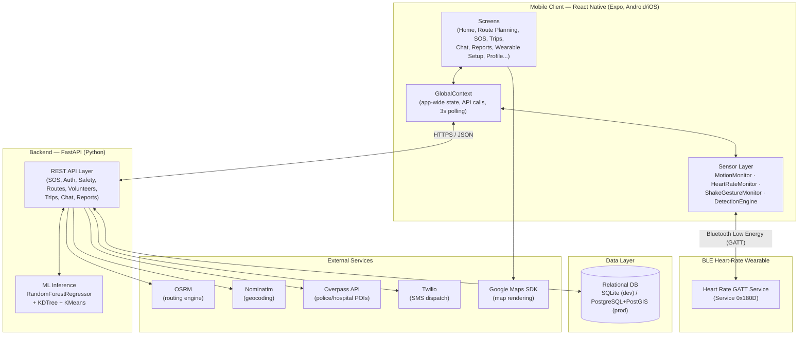
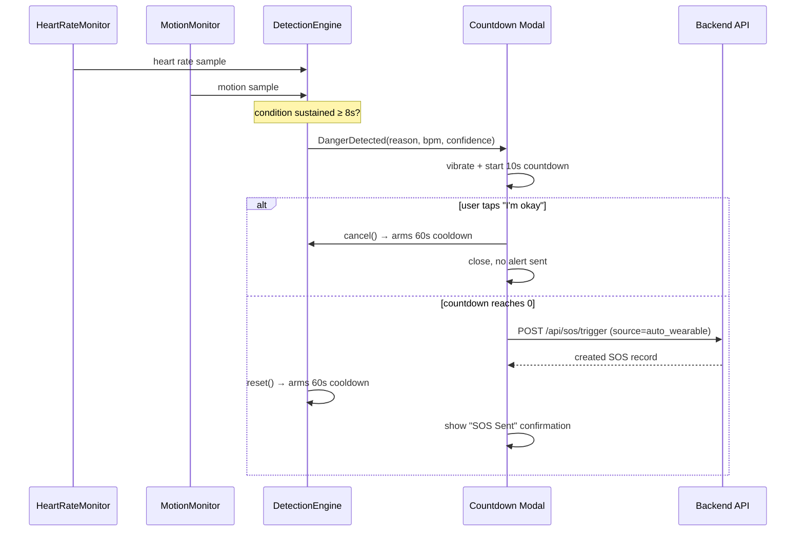
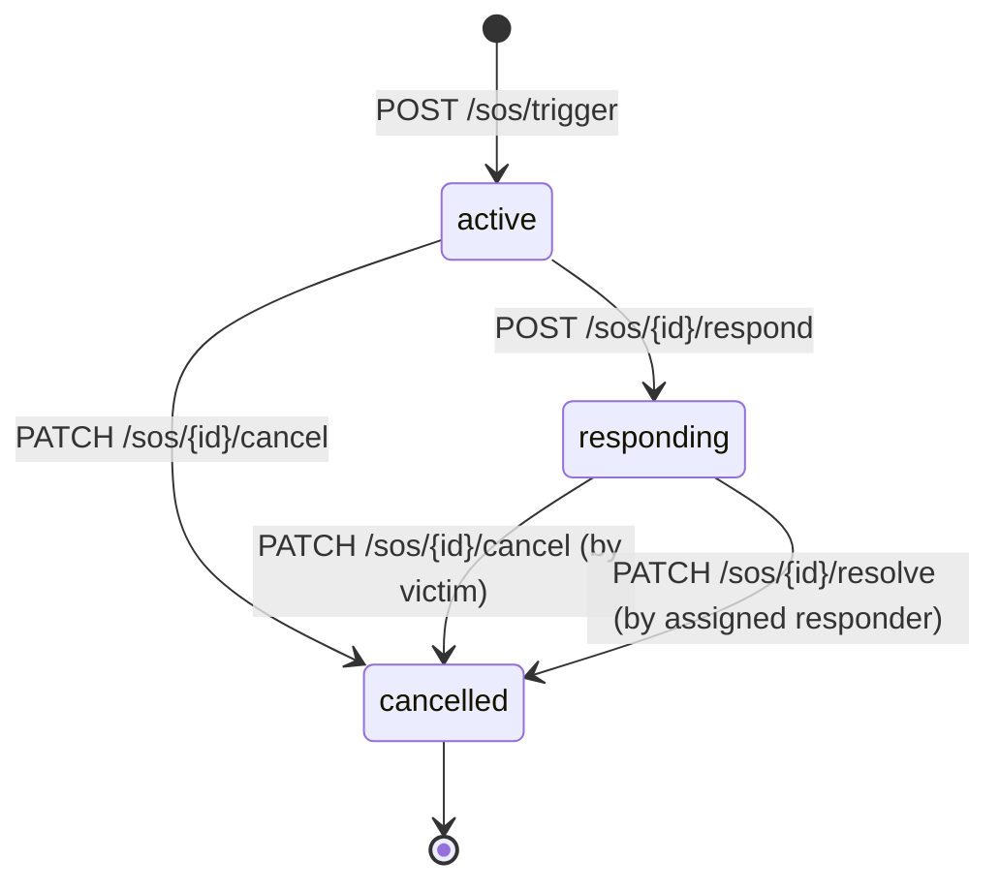

# AEGIS: System Architecture and Core Algorithms

**A Safety-First Navigation and Emergency Response Mobile Application**

---

## Abstract

AEGIS is a cross-platform mobile safety application built around four
cooperating subsystems: (1) crime-data-aware route planning that scores
candidate routes using a trained machine learning model, (2) a multi-channel
SOS emergency-alert pipeline — triggered manually, **automatically** by a
wearable heart-rate sensor fused with the phone's own motion sensors, or by a
deliberate shake gesture — (3) a community-response layer that matches active
SOS events to nearby volunteer responders by location and time-of-day
availability, lets a responder claim an event, automatically routes that
responder to the victim's location, and opens an in-app chat between them, and
(4) an independent trip-sharing feature that lets a lower-urgency "share my
walk/ride" session be tracked live by a trusted contact without involving the
SOS pipeline at all. This document describes the system's architecture and the
algorithmic core of each subsystem.

---

## 1. Introduction

Personal safety applications typically address either *prevention* (route
guidance, area-risk information) or *response* (emergency alerting), rarely
both, and rarely with an automatic, sensor-driven trigger that does not require
the user to be conscious or able to operate their phone. AEGIS was built to
close that gap:

- A user planning a route can see it scored and colored by real crime-incident
  density along its path, not just distance/time.
- A user in active danger can trigger an SOS manually, or discreetly via a
  hard shake of the phone when reaching for the screen isn't an option.
- A user who **cannot** manually trigger an SOS — due to a medical event, an
  assault, or unconsciousness — is covered by a wearable-driven automatic
  detection pipeline that fuses heart-rate and motion data, confirms the
  distress condition over a sustained window to avoid false positives, gives
  the user a cancellable countdown, and only then dispatches an alert.
- A user who wants to de-escalate or exit an uncomfortable situation without
  raising an alarm can trigger a realistic fake incoming-call screen from a
  discreet long-press shortcut.
- Any dispatched SOS event is visible to registered community volunteers and
  nearby app users, who can claim it as a responder; the responding user is
  then automatically routed to the victim's location and can chat with them
  in-app — closing the loop between detection and human response with an
  actual navigable path, not just a pin on a map.
- A user who wants a lower-urgency safety net for an ordinary walk or ride —
  short of anything SOS-worthy — can share a live trip with a trusted contact,
  who tracks it from a simple text-messaged code.

---

## 2. System Architecture

### 2.1 Architectural Overview

AEGIS follows a client–server architecture: a React Native mobile client
communicates with a stateless FastAPI backend over a REST API, backed by a
relational database and several external services.



### 2.2 Client Layer — Mobile Application

Built with **React Native 0.81** on **Expo SDK 54**, using the New Architecture
(Fabric). Key structural components:

| Component | Responsibility |
|---|---|
| `App.js` | Root composition — mounts the global context provider, the navigation container, a floating `GlobalSOSButton`, and a root-level `AegisMonitoringOverlay` that runs the wearable and shake-gesture detection pipelines independently of whatever screen is on-screen |
| `GlobalContext.js` | Single source of truth for session state (user profile, location, active SOS, active trip), the wearable/shake-gesture monitoring pipelines (`useAegisMonitoring`, `useShakeSOSTrigger`), and every backend API call |
| `AppNavigator.js` | Screen graph — bottom-tab navigator (Home, Route, SOS, Safety, Profile) nested inside a stack navigator (adds Onboarding, Login, Wearable Setup, Reports, Zones, Start Trip, Track Trip, Trip Active, Chat, Fake Call) |
| Sensor layer (`src/sensors/`) | Four cooperating modules — `MotionMonitor` (accelerometer), `HeartRateMonitor` (BLE GATT client), `ShakeGestureMonitor` (deliberate-shake detector), and `DetectionEngine` (HR + motion fusion / decision logic) — detailed in §3.1 and §3.6 |

The sensor layer is deliberately decoupled from any single screen: it is
instantiated once at the app root and exposes its live state (connection
status, discovered devices, pending detections) through context, so any screen
can observe or drive it without owning a second instance of the underlying
Bluetooth connection.

### 2.3 Server Layer — Backend API

Built with **FastAPI** (Python), served by **Uvicorn**, using **SQLAlchemy 2.0**
as the ORM. The API is stateless — every request is self-contained; no server-side
session state is kept between requests. Endpoints group into seven domains:

| Domain | Representative endpoints |
|---|---|
| Emergency (SOS) | `POST /api/sos/trigger`, `PATCH /api/sos/{id}/cancel`, `GET /api/sos/active`, `POST /api/sos/{id}/respond`, `PATCH /api/sos/{id}/resolve`, `GET /api/sos/{id}/status` |
| Authentication | `POST /api/auth/send-otp`, `POST /api/auth/verify-otp`, `POST /api/auth/register` |
| Volunteers | `POST /api/volunteers/register` |
| Safety intelligence | `GET /api/crimes/heatmap`, `GET /api/safety/current`, `GET /api/safety/safe-zone`, `GET /api/safety/police`, `GET /api/safety/hospitals` |
| Route planning | `GET /api/routes` |
| Trip sharing | `POST /api/trips/start`, `POST /api/trips/{id}/location`, `PATCH /api/trips/{id}/end`, `GET /api/trips/by-code/{code}` |
| Community reporting & chat | `POST /api/reports`, `GET /api/reports`, `PATCH /api/reports/{id}/respond`, `POST /api/reports/{id}/confirm`, `POST /api/messages`, `GET /api/messages` |

### 2.4 Data Layer

The database is deployment-agnostic — SQLite for local development, PostgreSQL
with the PostGIS extension in production (`GeoAlchemy2` supplies the geometry
column abstraction so model code does not change between the two). Core tables:

| Table | Purpose |
|---|---|
| `sos_events` | Every SOS, manual or auto-detected; status lifecycle, responder assignment, and (for wearable/shake-triggered events) a snapshot of the detection metadata that caused it — BPM, motion score, confidence, timestamp, source |
| `volunteers` | Registered community responders — location, response radius, time-of-day availability window, language, first-aid training flag |
| `users` | Registered app users |
| `crime_incidents` | ~32,500 seeded historical crime records used as ML training/inference input |
| `incident_reports` | Community-submitted non-emergency safety reports, with optional photos |
| `report_confirmations` | One row per (report, confirmer) — a nearby user vouching a report is real; a DB-level unique constraint on `(report_id, confirmer_phone)` enforces one confirmation per user per report atomically |
| `trips` | "Share my walk/ride" sessions — owner, optional recipient and destination, live coordinates, ETA, and status, independent of the SOS tables |
| `messages` | Chat messages, keyed by `(thread_type, thread_id)` — `"sos"` + `SOSEvent.id` or `"report"` + `IncidentReport.id` |
| `user_otps` | Short-lived OTP codes for phone verification |

### 2.5 External Services

- **OSRM** — computes alternative route geometries between two points; also
  used to route an assigned responder to a victim (§3.5).
- **Nominatim** — free-text place search and reverse geocoding.
- **Overpass API** — queries OpenStreetMap for nearby police stations/hospitals.
- **Twilio** — server-side SMS dispatch: login OTPs, emergency-contact and
  volunteer SOS alerts, and trip-tracking codes.
- **Google Maps SDK** — on-device map rendering (Android/iOS native).

---

## 3. Core Algorithms

### 3.1 Algorithm 1 — Wearable-Based Automatic Distress Detection

This is the system's most safety-critical algorithm: it must detect genuine
distress reliably, while rejecting false positives (e.g. the user simply
exercising, which also produces an elevated heart rate) aggressively enough
that the user is not spammed with unwanted emergency alerts.

**Inputs** (two independent, asynchronous sensor streams):
- Heart rate (bpm), streamed via a Bluetooth Low Energy GATT notification from
  any device implementing the standard Heart Rate Service (`0x180D`).
- Phone accelerometer magnitude, sampled every 500 ms and reduced to a
  rolling-window variance over the last ~10 seconds (a low variance indicates
  the phone — and, by inference, the wearer — is still; a sudden isolated
  spike indicates a possible fall).

**Constants:**

| Symbol | Value | Meaning |
|---|---|---|
| `HR_THRESHOLD` | 130 bpm | Heart rate counted as "elevated" |
| `STILLNESS_VARIANCE` | 0.02 | Accelerometer variance counted as "not moving" |
| `FALL_SPIKE_THRESHOLD` | 2.5 g | Sudden acceleration magnitude counted as a possible fall |
| `CONFIRM_WINDOW` | 8 s | Duration a condition must hold continuously before it is treated as detected |
| `COUNTDOWN` | 10 s | Cancellable window between detection and dispatch |
| `COOLDOWN` | 60 s | Suppression period after a cancel or a dispatch, before detection can fire again |

**Decision logic** (evaluated on every new heart-rate or motion sample):

```
function evaluate(heartRate, motion, now):
    if now < snoozeUntil:                       # cooldown active
        return NO_ACTION
    if alreadyFiredForThisEpisode:
        return NO_ACTION

    highHR      ← heartRate > HR_THRESHOLD
    isStill     ← motion.variance < STILLNESS_VARIANCE
    fallSpike   ← motion.magnitude > FALL_SPIKE_THRESHOLD

    conditionHolds ← fallSpike OR (highHR AND isStill)

    if not conditionHolds:
        conditionSince ← null                    # reset — condition must be *continuous*
        return NO_ACTION

    if conditionSince is null:
        conditionSince ← now                      # start the confirm window
        return NO_ACTION

    if (now - conditionSince) ≥ CONFIRM_WINDOW:
        alreadyFiredForThisEpisode ← true
        confidence ← computeConfidence(highHR, isStill, fallSpike, heartRate)
        reason ← fallSpike ? "fall" : "elevated_hr_stillness"
        emit DangerDetected(reason, heartRate, motion.variance, confidence, now)
```

**Confidence scoring** (a documented heuristic, not a trained classifier):

```
function computeConfidence(highHR, isStill, fallSpike, heartRate):
    score ← 0.5                                   # base
    if highHR:                    score += 0.20
    if isStill:                   score += 0.15
    if fallSpike:                 score += 0.25
    if heartRate > HR_THRESHOLD + 20:  score += 0.10
    return min(score, 0.98)
```

**Post-detection flow.** A `DangerDetected` event does not itself send an
alert — it hands control to a ten-second, user-cancellable countdown:



Arming the cooldown on **both** the cancel path and the successful-send path
(not just cancel) is a deliberate correctness requirement: without it, a
still-elevated heart-rate reading would immediately begin a fresh 8-second
confirm window the instant the previous one finished, re-dispatching a new SOS
approximately every 18–20 seconds for as long as the underlying condition
persisted.

**Resilience.** Because a Bluetooth connection to a wearable can silently drop
at the operating-system level without the expected disconnect callback firing
(observed in testing on Android), the connection is independently re-verified
on a fixed interval rather than trusted indefinitely, and a dropped connection
is automatically retried against the last-known device up to 5 attempts,
3 seconds apart.

### 3.2 Algorithm 2 — ML-Based Geographic Safety Scoring

Used both for scoring candidate routes (Route Planning), for scoring the
user's current location (Home / Safety screens), and as the routing engine
behind responder-to-victim navigation (§3.5).

**Model.** A `RandomForestRegressor` (scikit-learn; 100 trees, max depth 16)
trained to predict a continuous danger score from geographic and temporal
features.

**Training data construction** (`train_model.py`):
1. **Positive examples** — every coordinate in a ~32,500-row historical crime
   dataset, labeled `severity = 1`, with a synthetic incident time sampled
   from a normal distribution centered at 22:00 (crime is modeled as
   predominantly nocturnal).
2. **Negative examples** — up to 10,000 synthetically generated "safe zone"
   coordinates, uniformly sampled across the metro bounding box and filtered
   to a minimum distance from every known crime coordinate (via a k-d tree
   nearest-neighbor query), labeled `severity = 0`, with a synthetic time
   centered at 12:00 (daytime).
3. **Feature engineering**, applied identically at training and inference time:
   - **Spatial density** — inverse mean distance to the 50 nearest crime
     coordinates (a k-d tree range query), capturing local crime concentration.
   - **Hotspot proximity** — distance to the nearest of 20 crime hotspot
     centroids, found by k-means clustering the positive examples.
   - **Cluster membership** — which of the 20 hotspot clusters the point
     falls nearest to, used as a categorical feature.
4. Final feature vector per point: `[latitude, longitude, hour_of_day,
   spatial_density, hotspot_distance, cluster_id]`.
5. The trained model, the fitted K-Means clusterer, and the crime k-d tree are
   packaged together into a single `aegis_safety_v2.pkl` (via `joblib`) so
   feature engineering at inference time reuses the exact same spatial
   structures the model was trained against.

**Inference:**

```
function dangerScore(lat, lon):
    density  ← 1 / mean(distance to 50 nearest crime points)
    clusterId ← nearest_kmeans_cluster(lat, lon)
    hotspotDist ← distance(lat, lon, nearest_cluster_centroid)
    features ← [lat, lon, current_hour, density, hotspotDist, clusterId]
    predictions ← forest.predict(features)     # one prediction per tree
    return mean(predictions) + 0.4 * max(predictions)
```

Blending the mean prediction with a weighted maximum (rather than using the
mean alone) deliberately biases the score toward the forest's most
pessimistic tree — a conservative choice appropriate for a safety application,
where under-estimating risk is a worse failure mode than over-estimating it.

**Route scoring.** For each candidate route returned by OSRM, every coordinate
along the route geometry is scored and the route's overall danger score is the
same mean-plus-weighted-max aggregation applied along its full length. Routes
are then labeled **Fastest** (lowest ETA), **Safest** (lowest danger score),
or **Balanced**, and the danger score is linearly mapped to a 0–100 "safety %"
for display.

*Caveat:* `train_model.py` fits on the full generated dataset with no held-out
evaluation split gating a retrain — a separate offline script (`evaluate.py`)
exists to compare candidate model architectures (Random Forest, XGBoost, an
MLP) on train/test splits with precision/recall/F1, but it is not wired into
the production training or loading path, so a bad retrain of `train_model.py`
itself is not automatically caught.

### 3.3 Algorithm 3 — Nearby Responder Matching

When an SOS is dispatched, the backend identifies which registered volunteers
should be notified and shown as potential responders.

```
function findNearbyResponders(sosLat, sosLon, currentHour):
    matches ← []
    for each volunteer in volunteers:
        distance ← haversine(sosLat, sosLon, volunteer.lat, volunteer.lon)
        if distance ≤ volunteer.radius AND isAvailable(volunteer, currentHour):
            matches.append(volunteer)
    return matches

function isAvailable(volunteer, hour):
    match volunteer.availability:
        "Always":   return true
        "Mornings": return 6 ≤ hour < 12
        "Evenings": return 12 ≤ hour < 21
        "Nights":   return hour ≥ 21 OR hour < 6
```

Distance uses the standard haversine great-circle formula against the
volunteer's own configured response radius (default 2 km), and time-of-day is
evaluated in local (IST) time so a volunteer registered as "Nights available"
is not paged during their working day. Matched volunteers are both notified
by SMS (when Twilio credentials are configured) and surfaced to other nearby
app users via the live SOS feed, so a response can come through either
channel.

### 3.4 Algorithm 4 — SOS Event Lifecycle

Every SOS event, regardless of trigger source (manual button, wearable
detection, or shake gesture), moves through the same state machine
server-side:



`active` and `responding` events are visible to nearby users via
`GET /api/sos/active` (distance-filtered, excluding the triggering user's own
phone number). Nearby app clients poll this endpoint on a fixed 3-second
interval while the user has a known location, giving near-real-time
visibility into unfolding emergencies without requiring a push-notification
infrastructure.

Two implementation details worth noting:

- **No distinct "resolved" status exists in storage.** `PATCH
  /api/sos/{id}/resolve` and `PATCH /api/sos/{id}/cancel` both write the same
  terminal `status = "cancelled"` — they are distinguished only by who is
  allowed to call them (the assigned responder vs. the victim) and by which
  timestamp/actor initiated it, not by a separate status value.
- **Claiming a responder is race-safe.** `respond_to_sos` uses a single
  atomic conditional `UPDATE ... WHERE status != 'cancelled' AND
  responder_id IS NULL` rather than a read-then-write check, so two users
  tapping "Respond" on the same SOS within milliseconds of each other cannot
  both succeed — the loser's UPDATE simply matches zero rows and gets a
  clear "already being handled" error instead of silently overwriting the
  first responder's claim. `resolve_sos` and the trip-location/trip-end
  endpoints (§3.5, §2.4) use the identical atomic-conditional-UPDATE pattern
  for the same reason.

### 3.5 Algorithm 5 — Responder-to-Victim Routing

Once a community member is assigned as the responder for an active SOS
(`responder_id` matches their own phone number in the polled `nearbySOS`
list), the client does not just show a static marker for the victim — it
requests a real route to them, using the same engine built for route
planning:

```
function routeResponderToVictim(responderLocation, sosEvent):
    if responderId(sosEvent) != myPhone:
        clearRouteOverlay()
        return

    response ← GET /api/routes?
        start_lat=responderLocation.lat & start_lon=responderLocation.lon &
        end_lat=sosEvent.latitude   & end_lon=sosEvent.longitude

    bestRoute ← response.routes[0]          # backend's top-ranked candidate
    coords ← bestRoute.geometry.coordinates
    drawPolyline(coords)                     # live overlay on the responder's map
```

This re-invokes the exact `GET /api/routes` endpoint and ML-scoring pipeline
described in §3.2, rather than a separate "directions" implementation — a
responder gets a real, danger-aware navigable path to the victim, and the
overlay is recomputed whenever the responder's own live location updates
(the same `watchPositionAsync` GPS stream that drives every other live-map
feature in the app), so the route keeps correcting itself as the responder
moves. The overlay is cleared automatically the moment `nearbySOS` no longer
lists this device as the responder — e.g. if the victim cancels, or the
event is resolved.

### 3.6 Algorithm 6 — Shake-Gesture SOS

An independent, opt-in trigger for situations where no wearable is paired and
reaching for the SOS button isn't practical. It reuses accelerometer data
(like §3.1's motion channel) but is a deliberately distinct detector — a
*single* acceleration spike must not fire it (that is the fall-detector's job
in §3.1); only several qualifying peaks in quick succession count as the
gesture itself:

| Constant | Value | Meaning |
|---|---|---|
| `SHAKE_MAGNITUDE_THRESHOLD` | 3.2 g | Acceleration magnitude counted as a qualifying "peak" (higher than §3.1's 2.5 g fall threshold, since this must be a deliberate shake, not an incidental jolt) |
| `REFRACTORY_MS` | 200 ms | Minimum gap between counted peaks, so one swing isn't double-counted |
| `REQUIRED_PEAKS` | 4 | Qualifying peaks needed... |
| `WINDOW_MS` | 1500 ms | ...within this many milliseconds, to count as the gesture |
| `COOLDOWN` | 60 s | Suppression period after a cancel, mirroring §3.1's cooldown |

```
function onAccelerometerSample(sample, now):
    if now < cooldownUntil: return
    magnitude ← |sample|
    if magnitude < SHAKE_MAGNITUDE_THRESHOLD: return
    if now - lastPeakAt < REFRACTORY_MS: return       # same swing, don't double-count

    lastPeakAt ← now
    peakTimestamps.push(now)
    peakTimestamps ← filter(peakTimestamps, t → now - t ≤ WINDOW_MS)

    if len(peakTimestamps) ≥ REQUIRED_PEAKS:
        peakTimestamps ← []
        emit ShakeDetected(now)
```

Because the shake itself already requires deliberate, repeated intent, no
multi-second confirm window (analogous to §3.1's `CONFIRM_WINDOW`) is needed
before it counts as detected — but the detection still flows into the same
shared 10-second cancellable countdown UI, and dispatches through the same
`triggerSOS` path with `source = "auto_shake"`, so the victim gets an
identical chance to cancel and the backend records an identical audit trail
minus the HR/motion snapshot (which a shake gesture has no wearable data to
provide).

---

## 4. Technology Stack Summary

| Layer | Technology |
|---|---|
| Mobile framework | React Native 0.81, Expo SDK 54 (New Architecture / Fabric) |
| Navigation | React Navigation (native-stack + bottom-tabs) |
| Device sensors | `expo-sensors` (accelerometer), `react-native-ble-plx` (Bluetooth LE) |
| Local persistence | `@react-native-async-storage/async-storage` (user session + profile survive app restarts) |
| Maps | `react-native-maps` (Google Maps provider) |
| Backend framework | FastAPI + Uvicorn (Python, ASGI) |
| ORM | SQLAlchemy 2.0 (+ GeoAlchemy2 for geometry columns) |
| Database | SQLite (development) / PostgreSQL + PostGIS (production) |
| Machine learning | scikit-learn (`RandomForestRegressor`, `KMeans`), SciPy (`cKDTree`), NumPy, pandas |
| SMS dispatch | Twilio |
| Routing / geocoding | OSRM, OpenStreetMap Nominatim, Overpass API |

---

## 5. Conclusion

AEGIS demonstrates how several normally-separate categories of safety
application — predictive route intelligence, multi-channel reactive emergency
alerting, community-based response coordination, and lightweight trip
sharing — can share a single architecture and data model. The most technically
significant contribution is the automatic, sensor-fused distress detection
pipeline (§3.1, §3.6): by requiring a *sustained*, *combined* signal across
two independent sensor modalities (or, for the shake gesture, deliberate
repeated intent) before ever prompting the user, and by always interposing a
cancellable countdown before dispatch, the system is designed to catch genuine
emergencies — including ones where the user is physically unable to act —
while remaining resistant to the false positives that would otherwise make an
always-on automatic alert system impractical to actually use. The
responder-routing algorithm (§3.5) closes the loop on the response side the
same way: a community member who claims an SOS is not just told where a
victim is, but is given the same danger-aware navigable route the app already
computes for its own users, turning a willingness to help into an actual path
to act on it.
